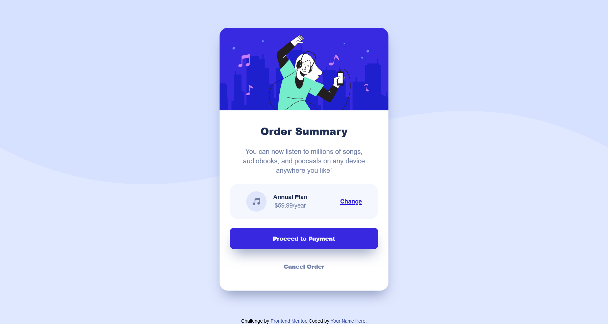

# Frontend Mentor - Order summary card solution

This is a solution to the [Order summary card challenge on Frontend Mentor](https://www.frontendmentor.io/challenges/order-summary-component-QlPmajDUj). Frontend Mentor challenges help you improve your coding skills by building realistic projects.

## Table of contents

- [Overview](#overview)
  - [The challenge](#the-challenge)
  - [Screenshot](#screenshot)
  - [Links](#links)
- [My process](#my-process)
  - [Built with](#built-with)
  - [What I learned](#what-i-learned)
  - [Continued development](#continued-development)
- [Author](#author)

## Overview

### The challenge

Users should be able to:

- See hover states for interactive elements
- Responsiveness
- CSS layout

### Screenshot

### Links

- Solution URL: [github repo](https://github.com/VighneshManjrekar/frontend-mentor-challenges/tree/main/order-summary-component)
- Live Site URL: [live demo](http://vighnesh-manjrekar.me/frontend-mentor-challenges/order-summary-component)

### Built with

- Semantic HTML5 markup
- CSS custom properties
- Flexbox
- Mobile-first workflow

### What I learned

Learnt more about CSS styling and html layouts using flex!

### Continued development

Looking forward to learn more about flex and grids for responsive designs and also looking for some more fun projects.

## Author

- Website - [Vighnesh Manjrekar](https://vighnesh-manjrekar.me/)
- Frontend Mentor - [@VighneshManjrekar](https://www.frontendmentor.io/profile/VighneshManjrekar)
- Twitter - [@Vighnesh73](https://www.twitter.com/Vighnesh73)
