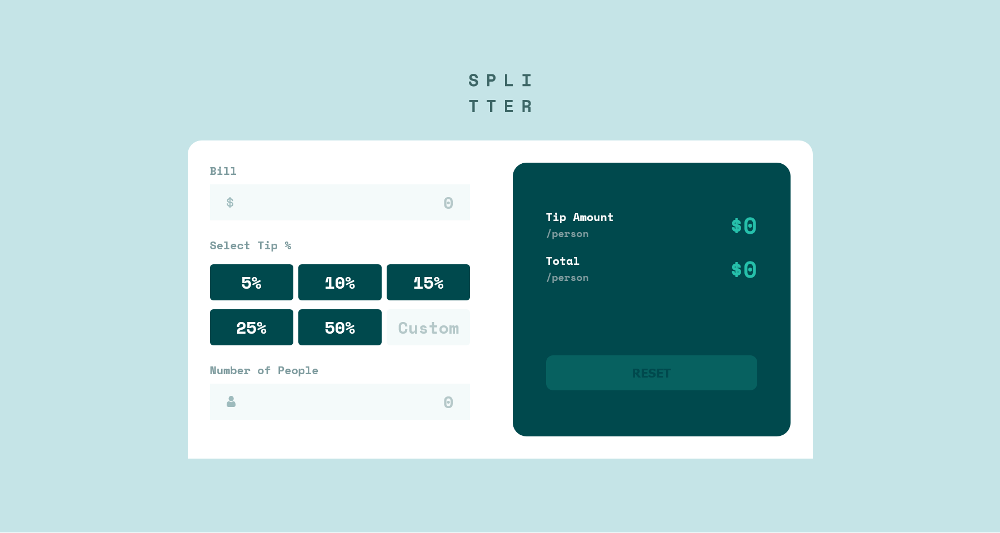

# Frontend Mentor - Tip calculator app solution

This is a solution to the [Tip calculator app challenge on Frontend Mentor](https://www.frontendmentor.io/challenges/tip-calculator-app-ugJNGbJUX). Frontend Mentor challenges help you improve your coding skills by building realistic projects.

## Table of contents

- [Overview](#overview)
  - [The challenge](#the-challenge)
  - [Screenshot](#screenshot)
  - [Links](#links)
- [My process](#my-process)
  - [Built with](#built-with)
  - [What I learned](#what-i-learned)
  - [Continued development](#continued-development)
- [Author](#author)

**Note: Delete this note and update the table of contents based on what sections you keep.**

## Overview

### The challenge

Users should be able to:

- View the optimal layout for the app depending on their device's screen size
- See hover states for all interactive elements on the page
- Calculate the correct tip and total cost of the bill per person

### Screenshot

### Links

- Solution URL: (https://github.com/VighneshManjrekar/frontend-mentor-challenges/tree/main/tip-calculator-app)
- Live Site URL: (https://vighnesh-manjrekar.me/frontend-mentor-challenges/tip-calculator-app)

## My Process

### Built with

- Semantic HTML5 markup
- CSS custom properties
- Flexbox
- Mobile-first workflow

### What I learned

Learnt more about CSS styling and html layouts using flex! Also DOM manipulation and error representation part was very challenging. I am very glad that I went through this amazing experience by choosing this challenge!

### Continued development

I am looking forward to look more into DOM manipulation and flex box for responsiveness of my future projects!

## Author

- Website - [Vighnesh Manjrekar](https://vighnesh-manjrekar.me/)
- Frontend Mentor - [@VighneshManjrekar](https://www.frontendmentor.io/profile/VighneshManjrekar)
- Twitter - [@Vighnesh73](https://www.twitter.com/Vighnesh73)
